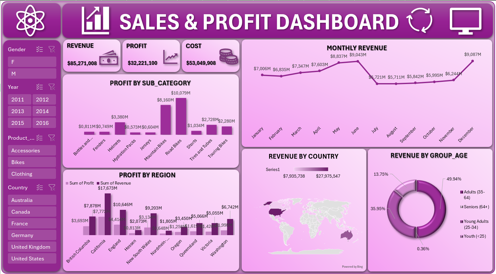

# Bike Sales Dashboard  

This project is an interactive Excel dashboard created to analyze and visualize bike sales data.  
It provides key insights into revenue, profit, and customer demographics while allowing users to explore data interactively with filters and slicers.  

## Dashboard Overview  
The dashboard highlights:  
- **KPIs**:  
  - Total Revenue    
  - Total Cost  
  - Total Profit  

- **Visuals**:  
  - Line Chart: Monthly Revenue Trend  
  - Column Chart: Top 10 Sub-categories by Profit  
  - Donut Chart: Revenue by Age Group  
  - Map: Revenue by Country  
  - Combo Chart: Top 10 States by Profit & Revenue  

- **Slicers**:  
  - Year  
  - Gender  
  - Country  
  - Product  

  

## How to Use  
1. Download the `Bike_Sales_Data.xlsx` file.  
2. Open it in Microsoft Excel.  
3. Use the slicers (Year, Gender, Country, Product) to interact with the dashboard.  
4. Explore insights from different perspectives.  

## Tools & Skills Used  
- **Microsoft Excel**  
  - PivotTables  
  - PivotCharts  
  - Slicers  
  - Map Chart  
- **Data Cleaning & Preparation**  
- **Data Visualization & Dashboard Design**  
